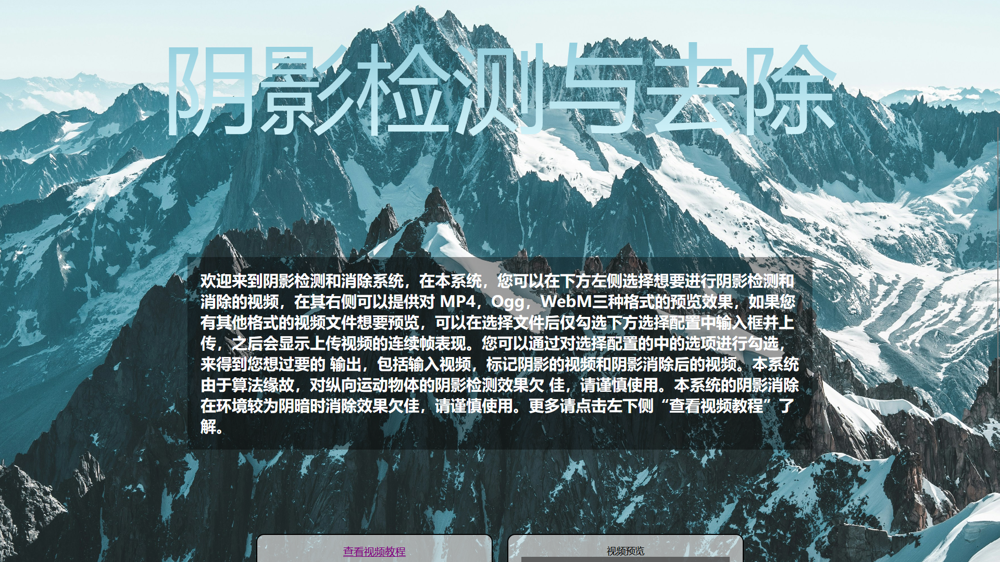
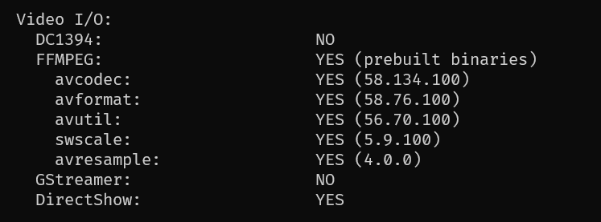

# CaiFish




这是一个山东潍坊学院计算机院的毕业设计项目，前端设计文件上传和视觉传达，后端使用OpenCV对视频进行阴影去除并返回。这个毕业设计项目的文档中直接使用OpenCV的自带预览来获取截图(咱也不知道是为了方便还是根本做不了前后端通信)。

所以我用了点时间直接把论文理想的产品(的大部分)做了，其中OpenCV的处理函数来自[MayureshPG1/Shadow-Detection-Removal](https://github.com/MayureshPG1/Shadow-Detection-Removal)，背景图片来自[unsplash](https://images.unsplash.com/photo-1536264911542-668b0180d5a1?ixlib=rb-0.3.5&q=85&fm=jpg&crop=entropy&cs=srgb&ixid=eyJhcHBfaWQiOjE0NTg5fQ&s=a9a32743f06349efc39aeae90f047e9f)，前端使用原生html+css+javascript，后端使用C++进行[OpenCV](https://github.com/opencv/opencv)处理和[Httplib](https://github.com/yhirose/cpp-httplib)进行服务器搭建。

前端部分使用base64方式进行文件上传，后端依靠OpenCV集成ffmpeg调用openh264进行输出处理(OpenCV因为协议原因不会深度集成openh264)

# 编译

分为前端和后端两个部分，对应forepage和c_backend

本项目需要拉取Http-lib子模块，你应该使用以下命令克隆：

```bash
git clone --recursive git@github.com:HowXu/CaiFish.git
```
或者在正常克隆后运行以下命令拉取子模块：

```bash
git submodule init
git submodule update
```

## 前端

不需要编译，直接把html文件所在目录放在反向代理文件夹中即可，在index.js文件可以看到完整的上传逻辑和处理逻辑，请自行查阅

## 后端

在Windows 11上使用Mingw64和OpenCV库进行构建，请确保**正常安装并配置了Mingw64,OpenCV(必须带有ffmpeg支持),cmake**

OpenCV编译配置例如:



在c_backend目录下运行：

```bash
cmake CMakeLists.txt -G "MinGW Makefiles"
make
```

即可在build目录下获得output.exe文件。

将openh264动态链接文件(强制要求为1.8.0版本),运行该文件即可在本地1234端口上开启处理服务器。

# 商菜鱼是真菜(确信)
